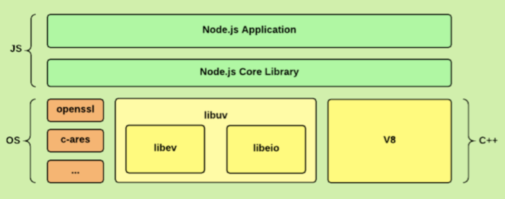
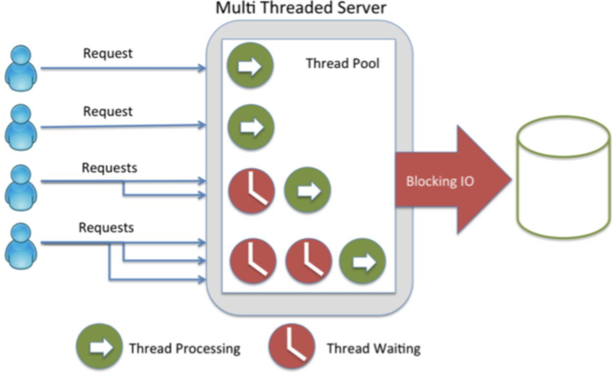

# Node.js Intro
*Mohammed Essehemy*

---
Remember,

Before you can be great, you've got to be good

Before you can be good, You've got to be bad

But, before you can even be bad,

**You've got to try**
<cite>Art Williams</cite>

---
# what is Node.js

---

# Open source

**Asynchronous, event driven** JavaScript **runtime**

designed to build **scalable** network applications

---

# what?

# 🥺🥺😢

---

---

---

# 😢🤯

---

# let's break it down

---

---

# easy, let's go on

# 💪💪💪

---

---

---

# But, why should I use it???

# 🤔🤔🤔

---

---

# But, will I be alone??

# 🤨🤨🤨

---

---

# let's build a simple CLI.

# 🏋️‍♀️

---

# Core modules

---

---

# simple, easy, great community.

# welcome to the community.

👋🤗👋🤗
