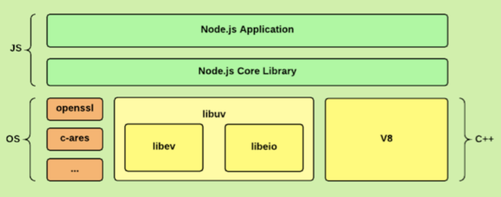
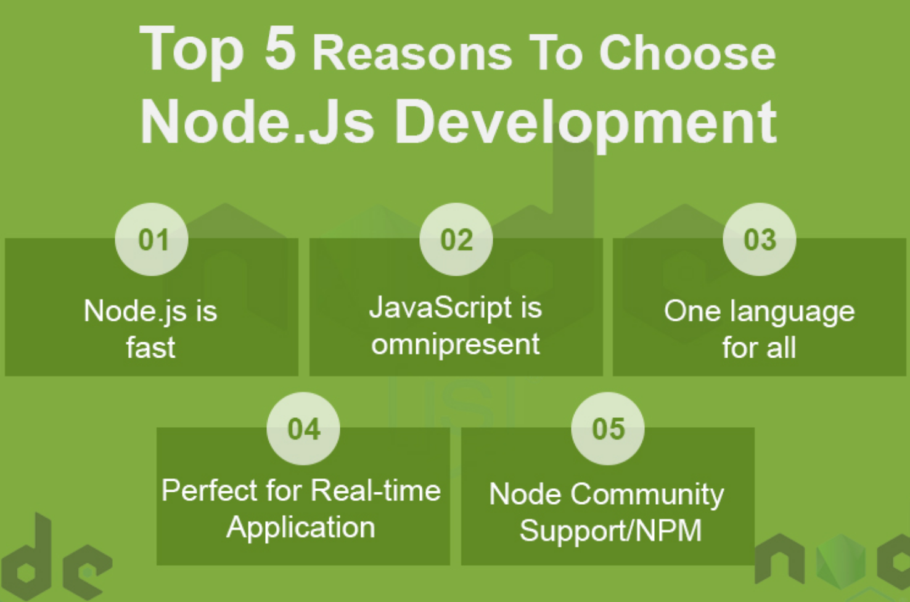
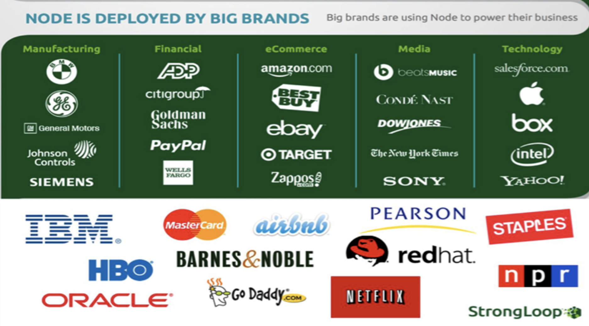

# Node.js Intro
*Mohammed Essehemy*

---
Remember,

Before you can be great, you've got to be good

Before you can be good, You've got to be bad

But, before you can even be bad,

**You've got to try**
<cite>Art Williams</cite>

---
# what is Node.js

---

**Asynchronous event driven** JavaScript **runtime**, designed to build **scalable** network applications

---

# what? 🥺🥺😢
---

---

# 😢🤯

---

# let's break it down

---

---

# easy, let's go on 💪💪💪

---

---

---

# I knew it, but why should I use it??? 🤔🤔🤔

---

---

# But will I be alone??

---

