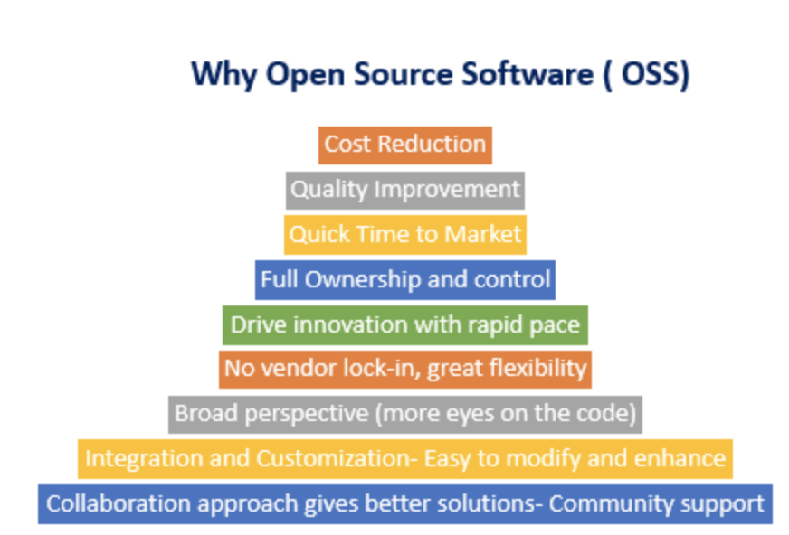
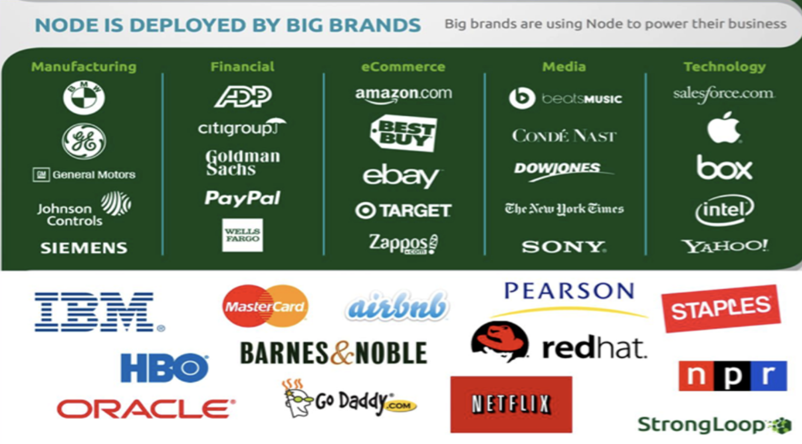

# what is Node.js

---

# Open source

**Asynchronous, event driven** JavaScript **runtime**

designed to build **scalable** network applications

---

# let's break it down

---

---

---

# why should I use it??

# 🤔🤔🤔

---

---

# will I be alone??

# 🥺🥺🥺

---

